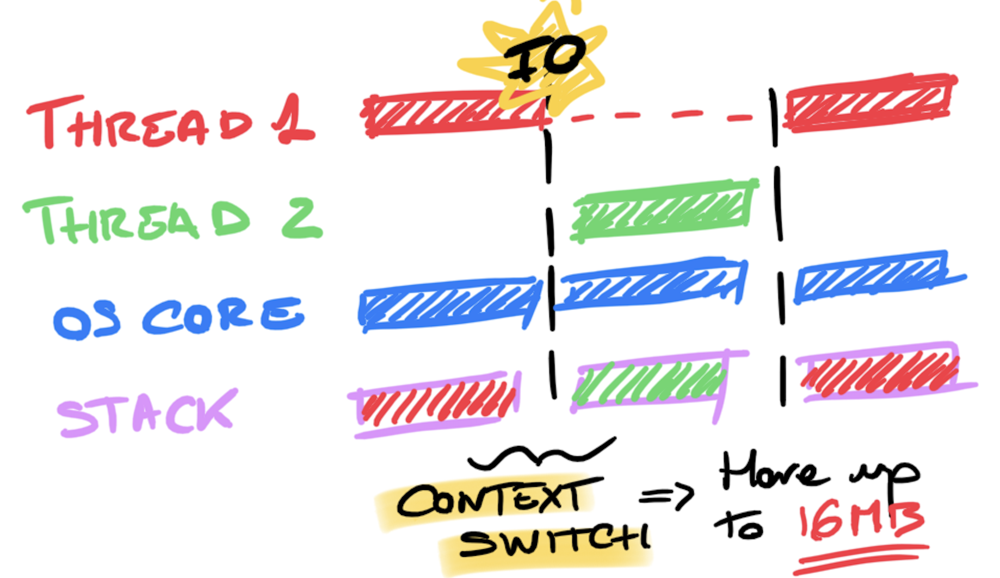
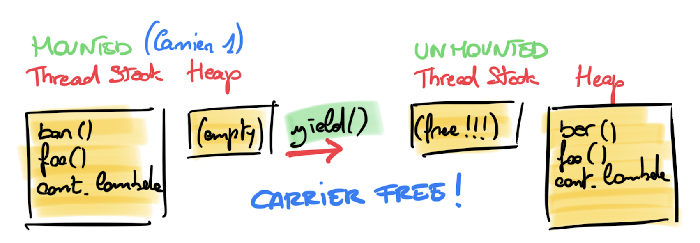
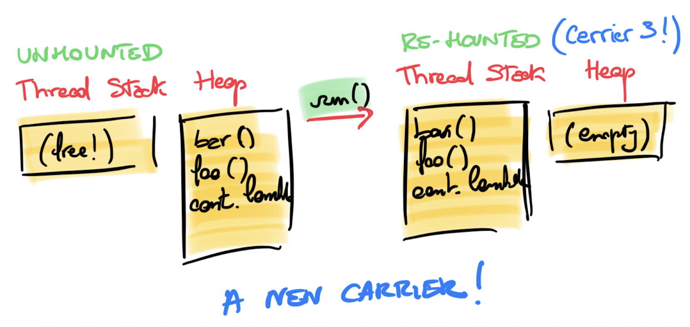
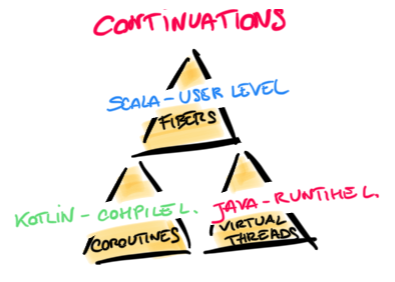

<!-- _class: lead -->
<!-- _footer: "" -->
<!-- _paginate: false -->


<style scoped>
section { background-position: center top; }
</style>


# The Concurrency Triangle

## Scala Fibers, Kotlin Coroutines, and Java Virtual Threads

### Riccardo Cardin
**Scalar 2026**

<!--
Today I want to show you something funny. Scala, Kotlin, and Java — three very different worlds — they all solved concurrency in the same way. Same pattern. Same pieces. They just put them in different places. And by the end of this talk, you'll see it everywhere.

My name is Riccardo Cardin, and this is The Concurrency Triangle.
-->

---

# Agenda

1. Who Am I?
2. The Problem
3. Scala Fibers — Continuations at the user level
4. Kotlin Coroutines — Continuations at compile time
5. Java Virtual Threads — Continuations at runtime
6. References

<!--
So here's the plan. First, we'll look at the problem — why OS threads don't scale. Then we'll see how Scala fixes it with fibers, how Kotlin fixes it with coroutines, and how Java fixes it with virtual threads. And then we put them side by side and... surprise.
-->

---

# Who Am I?

- Hello there 👋, I'm **Riccardo Cardin**, 
    * An Enthusiastic Scala Lover since 2011 💯
    * The creator of **YAES** (Yet Another Effect System)

&nbsp;&nbsp;&nbsp;&nbsp;&nbsp;&nbsp;&nbsp;&nbsp;&nbsp;&nbsp;&nbsp;&nbsp;&nbsp;&nbsp;&nbsp;&nbsp;&nbsp;&nbsp; 

<!--
Quick intro — I've been doing Scala since 2011, so about fifteen years now. I also built YAES — Yet Another Effect System — a small effect system for Scala. The QR codes on screen go to my GitHub, LinkedIn, and blog if you want to connect.

Ok, let's go.
-->

---

# Concurrency vs. Parallelism

- **Concurrency** is a semantic feature **of a problem**
  - Many **tasks** that can be **interleaved**
  - We can have concurrency with a **single executor**

```
Task 1:     [1] [2] [3]
Task 2:     [a] [b] [c]
Execution:  [1] [2] [a] [3] [b] [c]   ← one executor, interleaved
```

- **Parallelism** is a property **of the runtime**
  - Enough **resources** to run tasks **at the same time**

```
Executor 1: [1] [2] [3]
Executor 2: [a] [b] [c]   ← two executors, truly simultaneous
```

- Today: **concurrency** — how to interleave many tasks on limited threads

<!--
Before we start fixing things, let's make sure we agree on what we're fixing.

Concurrency and parallelism — not the same thing.

Concurrency is about the problem. You have many tasks, and they can run in any order. You can do concurrency with just one core — one executor juggling tasks, switching between them. Look at the diagram: Task 1 and Task 2 interleaves their execution on one executor. That's concurrency.

Parallelism is about resources. You have enough CPUs to run things at the same time. Two executors, running together.

Today we're talking about concurrency. Many tasks, few threads. The question is: who decides what runs next, and how much does it cost?
-->

---

<style>
  img[alt=context-switch] {
    width: 45%;
    display: block;
    margin: 0 auto;
  }
</style>

# Threads Block, And That's the Problem

- When a thread calls I/O, it **blocks**
  - The **entire thread stack** is frozen
  - The OS **unmounts** the thread — another is **mounted**: **context switch**
- Context switching is **expensive**
- The OS has **no idea** what our program wants to do next



<!--
Ok, so here's where things break.

When a thread calls a database, or makes an HTTP request, it blocks. The whole thread just sits there. The OS steps in — it saves everything, all the registers, all the state — and loads another thread. That's a context switch.

And context switches are not cheap. The OS has to go through the kernel, it trashes the CPU caches, it moves kilobytes of data around. And the worst part? The OS has no idea what our program wants to do next. So it saves everything. Just in case.

Quick question for the room — how many of you have seen thread exhaustion in production? That moment when your service stops answering because all threads are just... waiting?

Yeah. That's what we're fixing today. The OS manages the scheduling, but the OS doesn't know anything about our program.
-->

---

# What If WE Manage the Scheduling?

- The OS doesn't know what our tasks need — but **we do**
- Key idea: save **what to do next** — a **continuation**

```scala
// The continuation is implicit (it's the next line)
val result = add(1, multiply(2, 3))
println(s"The result is: $result")

// Continuation-Passing Style — the continuation is explicit
multiplyCPS(2, 3) { multiplyResult =>
  addCPS(1, multiplyResult) { addResult =>
    println(s"The result is: $addResult")
  }
}
```

- **Suspend** a task: save its continuation, **free the thread**
- **Resume** it later: pick up the continuation — on **any** thread

<!--
So here's the idea. The OS doesn't know what our tasks need. But we do.

When a task is waiting for I/O, we know exactly what should happen next. It's the next line of code. The callback. In fancy words: the continuation.

Look at the code. In normal code, the continuation is just the next line — you don't think about it. In continuation-passing style, you make it visible: "when this finishes, call that function."

So the trick is: when a task blocks, save the continuation — just that small piece — free the thread, and pick it up later on any thread.

That's the idea behind fibers. Behind coroutines. Behind virtual threads. Same idea, three times.
-->

---

# What We Need

A continuation-based runtime needs four things:

1. A definition of what a **continuation** is
2. A **thread pool** to run continuations — the **workers**
3. A **scheduler** to pick the next continuation to run — the **decision-maker**
4. A way to **yield** or **suspend** a continuation

Let's see how **Scala**, **Kotlin**, and **Java** implement each of these.

<!--
Every solution we'll see today needs four things. Just four.

First: what is a continuation? How do we represent it? Second: a thread pool to run them — those are the workers, the actual threads that execute code. Third: a scheduler to pick the next one — that's the decision-maker, the logic that says "you go next." They're related but not the same thing: the thread pool is the "where," the scheduler is the "who's next." Fourth: a way to pause — to yield, to suspend, to say "I'm done for now, come back later."

Keep these four in your head. We'll see them in Scala. Then in Kotlin. Then in Java. Every time, the same four things.

Same recipe, different kitchens.
-->

---


<style scoped>
section { background-position: center top; }
</style>

<!-- _class: divider -->
<!-- _footer: "" -->
<!-- _paginate: false -->


# Scala Fibers

## Continuations at the **User Level**

- Continuation lives in **library/runtime objects** (`FlatMap` chain + `Async` callback)

<!--
Let's start with Scala. We're at Scalar, so this is home.

In Scala, the continuation lives in regular objects — FlatMap chains and Async callbacks. Nothing magic. Just data structures and functions that we build ourselves.
-->

---

# `IO`, Describing a Program as Data

- Scala's approach: **describe** the computation, **don't execute** it immediately
- The `IO` monad is an **ADT** — a tree of instructions

```scala
enum IO[+A]:
  case Pure(value: A)
  case Delay(thunk: () => A)
  case FlatMap[A, B](inner: IO[A], cont: A => IO[B]) extends IO[B]
```

- `Pure` — a completed value | `Delay` — a lazy thunk | `FlatMap` — **what to do next**

```scala
extension [A](io: IO[A])
  def flatMap[B](f: A => IO[B]): IO[B] = FlatMap(io, f)
  def map[B](f: A => B): IO[B] = FlatMap(io, a => Pure(f(a)))

object IO:
  def delay[A](thunk: => A): IO[A] = Delay(() => thunk)
```

<!--
Scala's way is: don't run the computation right away. First, describe it. Build a tree of instructions.

Look at the IO enum. Three cases. Pure — a value that's already done. Delay — a lazy thunk, something to run later. And FlatMap — this is the important one. It holds an inner IO and a function called cont: "when you get the result of the inner IO, call cont to decide what to do next." That cont function? That's a continuation.

Why describe instead of run? Because if it's data, we own it. We can decide when to run it, where to run it, how to run it.
-->

---

# `FlatMap` Chains: Sequential, Not Yet Concurrent

```scala
val bathTime: IO[Unit] =
  IO.delay(println("Going to the bathroom"))
    .flatMap(_ => IO.delay(Thread.sleep(500)))  // ⚠️ BLOCKS the thread!
    .flatMap(_ => IO.delay(println("Done!")))
```

```
FlatMap
├── FlatMap
│   ├── Delay(() => println("Going to the bathroom"))
│   └── step₂: _ => Delay(() => Thread.sleep(500))
└── step₃: _ => Delay(() => println("Done!"))
```

- Each `flatMap` stores "what to do next" — a **continuation**
- But this chain is **purely sequential**
- If step 2 blocks, the thread is **still blocked**
- We have continuations, but we're **not using them for concurrency yet**

<!--
So we build chains. Look at bathTime: print, then sleep, then print again. Each flatMap adds a step. You can see the tree on screen.

But here's the thing — this is still sequential. If step two does Thread.sleep, the thread blocks. We have continuations in the data structure, sure, but we're not using them to free the thread yet. We have the pieces, but something is missing.
-->

---

# The Run Loop: A Trampoline on the Heap

- Key insight: move the **call stack** from the **thread** to the **heap**

```scala
def unsafeRun[A](io: IO[A]): A =
  val stack = Stack[Any => IO[Any]]()   // ← continuation stack on the HEAP
  var current: IO[Any] = io
  while true do
    current match
      case Pure(value) =>
        if stack.isEmpty then return value.asInstanceOf[A]
        else current = stack.pop()(value)   // pop next continuation
      case Delay(thunk) => current = Pure(thunk())
      case FlatMap(inner, cont) =>
        stack.push(cont)                    // push continuation
        current = inner
  throw new RuntimeException("Unreachable")
```

- Execution state is now a **regular object** — we can **pause**, **save**, and **resume** it

<!--
Two problems to solve. First: recursive flatMap calls eat stack frames. Fix: replace recursion with a while loop and our own stack on the heap. FlatMap? Push cont, set inner as current. Pure? Pop the next continuation.

Now our execution state is a heap object we control. But the thread is still stuck in the loop — if something blocks, we can't free it. Heap stack: necessary, not sufficient. We still need a way to pause and release the thread.
-->

---

# `Async`, The Real Continuation

- `Async` bridges **callback-based APIs** into the `IO` world

```scala
enum IO[+A]:
  case Async(register: (Either[Throwable, A] => Unit) => Unit)

def sleep(millis: Long): IO[Unit] =
  IO.Async { cb =>    // cb is the continuation!
    scheduler.schedule(() => cb(Right(())), millis, MILLISECONDS)
  }
```

- The callback `cb` **is** the continuation — it resumes the computation when the external API completes
- But `unsafeRun` **can't handle this**: its `while` loop monopolizes the thread
- We need to **break the loop into single steps**, wrap the state in an object, and **yield the thread**

<!--
Async is the piece that solves blocking. Look at sleep: it hands a callback cb to a scheduler. When the timer fires, cb resumes the computation. That callback is the continuation.

Problem: unsafeRun is a while-true loop — it never releases the thread. We need to break execution into single steps, wrap the state in an object, and hand each step to a scheduler. That object is a Fiber.
-->

---
<!-- _class: small -->
<style scoped>
  section code { font-size: 20px; }
</style>

# Fibers: Putting It All Together

```scala
class IOFiber[A](io: IO[A], scheduler: Scheduler):
  private var currentIO: IO[Any] = io
  private val continuations = Stack[Any => IO[Any]]()

  def run(): Unit = currentIO match
    case Pure(value) => if continuations.nonEmpty then
      currentIO = continuations.pop()(value)
      scheduler.submit(this)
    case FlatMap(inner, cont) =>
      continuations.push(cont)
      currentIO = inner
      scheduler.submit(this)
    case Async(register) => register { case Right(value) =>
      currentIO = Pure(value)
      scheduler.submit(this)
    }
```

- After each step: **re-submit** to scheduler — **cooperative scheduling**

<!--
The run method has three branches. Pure: pop the next continuation, re-submit. FlatMap: push cont, re-submit. Async: register the callback — when it fires, re-submit.

Every step ends with re-submit. That's cooperative scheduling. At an Async boundary, the fiber suspends and releases the thread. When the callback fires, the fiber is re-submitted to the scheduler for execution. A fiber is just an object — you can have millions.
-->

---

# The Scheduler: Cooperative Scheduling

```scala
class Scheduler(threadPool: ExecutorService):
  private val queue = ConcurrentLinkedQueue[IOFiber[?]]()

  def submit(fiber: IOFiber[?]): Unit =
    queue.add(fiber)
    threadPool.submit(() => {
      val next = queue.poll()
      if next != null then next.run()
    })
```

- Fibers are enqueued and executed on a **fixed thread pool**
- Threads are **always busy** — no time wasted on blocked fibers
- **Cooperative scheduling**: fibers yield voluntarily at `Async` boundaries
- No **context switch** at the OS level

<!--
The scheduler is simple. Really simple. A queue of fibers and a thread pool. Fiber yields? Back in the queue. Thread free? Pick the next fiber. Threads are always busy. No OS context switches. That's it.
-->

---

# Putting It All Together

```scala
val bathTime: IO[Unit] = IO.delay(println("Going to the bathroom"))
    .flatMap(_ => sleep(500))
    .flatMap(_ => IO.delay(println("Done with the bath")))

val boilingWater: IO[Unit] = IO.delay(println("Boiling some water"))
    .flatMap(_ => sleep(1000))
    .flatMap(_ => IO.delay(println("Water is ready")))

val morningRoutine: IO[Unit] = for {
    fiberA <- bathTime.start
    fiberB <- boilingWater.start
    _      <- fiberA.join
    _      <- fiberB.join
  }  yield ()
```

- `start` creates a new `IOFiber` and submits it to the scheduler
- Both tasks run **concurrently** — **no OS threads wasted**

<!--
And here's the result. We start two fibers — bathTime and boilingWater. Each builds a chain of continuations. When they hit sleep, they suspend — thread is free. The scheduler runs something else. Timer fires, fiber wakes up. Two tasks, maybe one thread, zero context switches.
-->

---

<style>
  section table {
    display: table !important;
    width: auto !important;
    margin: 0 auto !important;
  }
</style>

# Scala's Continuation Machinery

- **Suspension points:** every `Async` boundary — the programmer **explicitly** chooses
- **Cats Effect**, **ZIO**, and **Kyo** add battle-tested optimizations:
  - **Auto-cede** — run ~1024 steps before yielding, not one-at-a-time
  - **Work-stealing pool** — idle threads steal tasks from busy ones

| Ingredient     | Scala (User Level)                          |
|----------------|---------------------------------------------|
| Continuation   | `Async` callback + `FlatMap` chain         |
| Thread Pool    | `ExecutorService` (e.g., work-stealing pool)|
| Scheduler      | Custom run loop + fiber queue               |
| Yield/Suspend  | `Async` case — callback-based suspension    |

<!--
Let me wrap up the Scala part. The continuation is the Async callback that wakes up a fiber's FlatMap chain. You, the programmer, choose where suspension happens. You see it, you control it.

Our toy version re-submits after every step. Real libraries — Cats Effect, ZIO, Kyo — they batch about 1024 steps before yielding. They use work-stealing pools. They handle cancellation. That's what makes them production-ready.

Now look at the table. Four rows. Continuation, thread pool, scheduler, yield. Remember these four rows. You're about to see them again.
-->

---


<style scoped>
section { background-position: center top; }
</style>

<!-- _class: divider -->
<!-- _footer: "" -->
<!-- _paginate: false -->

# Kotlin Coroutines

## Continuations at **Compile Time**

- Continuation lives in a **compiler-generated state machine** (`Continuation<T>`)

<!--
Now we cross the border to Kotlin. And this is where it gets fun — because Kotlin solves the same problem, but the continuation lives in a completely different place. Not in library objects. In a state machine that the compiler builds for you.
-->

---

# The Compiler Rewrites Your Code

- You write a **`suspend` function** — the compiler transforms it

```kotlin
// What you write
suspend fun bathTime() {
  logger.info("Going to the bathroom")
  delay(500L)
  logger.info("Done with the bath")
}
```

- The compiler: adds a `Continuation` parameter, splits at every **suspension point**

```kotlin
// What the compiler generates (simplified)
fun bathTime(callerContinuation: Continuation<*>): Any {
  val sm = callerContinuation as? BathTimeSM
    ?: BathTimeSM(callerContinuation)
  // ...
}
```

<!--
In Kotlin, you write a suspend function. It looks like normal code. But the compiler changes it. It adds a Continuation parameter and splits the body at every suspension point.

Look at bathTime. Three lines. Looks simple. But the compiler turns it into something different — a state machine with a Continuation parameter.

Does this feel familiar? A function that takes a callback for "what to do next"? We just saw this five minutes ago in Scala.
-->

---

# The State Machine Step by Step

```kotlin
fun bathTime(callerContinuation: Continuation<*>): Any {
  val sm = callerContinuation as? BathTimeSM
    ?: BathTimeSM(callerContinuation)       // ① Create state machine
  if (sm.label == 0) {                      // ② First segment
    logger.info("Going to the bathroom")
    sm.label = 1                            // ③ Set resume point
    if (delay(500L, sm) == COROUTINE_SUSPENDED)
      return COROUTINE_SUSPENDED            // ④ Yield the thread!
  }
  if (sm.label == 1) {                      // ⑤ Resumed here
    logger.info("Done with the bath")
  }
}
```

- **First call** (label 0): runs segment 1, returns `COROUTINE_SUSPENDED` — thread is **free**
- **Second call** (label 1): `delay` calls `sm.resumeWith()`, re-enters at label 1
- The `BathTimeSM` object holds **state** between calls

<!--
Here's what the compiler actually makes. Look at the labels.

Label 0: run the first part, log, set label to 1, call delay. If delay says COROUTINE_SUSPENDED — return. Thread is free.

Label 1: when delay is done, it calls sm.resumeWith(). The function runs again with the same state machine. Label is 1 now, so we jump to "Done with the bath."

The BathTimeSM object holds the state between calls. It is the continuation. Same job as Scala's Async callback plus FlatMap chain. Just built by the compiler, not in a library at user level.
-->

---

# `resumeWith`: The Continuation in Action

- `suspendCoroutine` suspends and provides the `Continuation` — Kotlin's `Async`

```kotlin
suspend fun delay(ms: Long) = suspendCoroutine { continuation ->
    Timer().schedule(object : TimerTask() {
        override fun run() {
            continuation.resumeWith(Result.success(Unit))
        }
    }, ms)
}
```

- Same pattern as Scala's `Async`:

```scala
ddef sleep(millis: Long): IO[Unit] =
  IO.Async { cb =>    // cb is the continuation!
    scheduler.schedule(() => cb(Right(())), millis, MILLISECONDS)
  }
```

- Both register a callback — when it fires, **resume the computation**

<!--
Now look at suspendCoroutine. This is a function from the Kotlin standard library — it's how you get access to the raw continuation object. You take it, hand it to a Timer, and when the timer fires, resumeWith picks up the coroutine.

Now look at the Scala code right below. IO.Async — you get a callback cb, you hand it to a Timer, and when the timer fires, you call cb. Same thing.

Both schedule a timer. Both resume via callback when the time is up. Different shape, same job. If you squint a little, suspendCoroutine is just Kotlin's version of Async.
-->

---

# Kotlin: Same Ingredients, Compiler-Generated

```kotlin
public interface Continuation<in T> {
  public val context: CoroutineContext
  public fun resumeWith(result: Result<T>)
}
```

- `resumeWith` resumes the caller — **this is CPS**
- **Suspension points:** every call to a `suspend` function — **compiler enforces** them

| Ingredient     | Kotlin (Compile Time)                       |
|----------------|---------------------------------------------|
| Continuation   | `Continuation<T>` interface + `resumeWith`  |
| Thread Pool    | Dispatcher (Default, IO, ...)               |
| Scheduler      | Dispatcher picks where to run               |
| Yield/Suspend  | `COROUTINE_SUSPENDED` return value          |

<!--
Same four things. Continuation is compiler-generated, with resumeWith. The Dispatcher is the scheduler. Suspension happens at every suspend call, and the compiler makes sure you can't miss it — that's function coloring.

There's the table again. Four rows. Same four rows. See the pattern?
-->

---


<style scoped>
section { background-position: center top; }
</style>

<!-- _class: divider -->
<!-- _footer: "" -->
<!-- _paginate: false -->


# Java Virtual Threads

## Continuations at **Runtime**

- Continuation lives in the **JVM runtime** (mounted/unmounted by the VM)

<!--
Last one. Java. And Java goes one level deeper — into the JVM itself. No library objects. No compiler tricks. The runtime just does it.
-->

---

# The JVM Does It For You

- Reuse the `Thread` API with a different implementation

```java
Thread vt = Thread.ofVirtual().start(() -> {
    System.out.println("Going to the bathroom");
    Thread.sleep(Duration.ofMillis(500));
    System.out.println("Done with the bath");
});

// Inside VirtualThread (JDK source code)
VirtualThread(..., Runnable task) {
    this.scheduler = scheduler;
    this.cont = new VThreadContinuation(this, task);
}
```

- **No coloring**, no special syntax, no monadic wrapping
- Virtual threads are **mounted** on platform threads (**carrier threads**)
- `Thread.sleep`, `Socket.read` — **unmount** automatically

<!--
Look at this code. Thread.ofVirtual().start(). That's all. No IO, no suspend, no flatMap. Just Thread.sleep. And it works.

Under the hood, VirtualThread wraps a Continuation object. A carrier thread is a real OS thread that runs the virtual thread. When the virtual thread calls sleep or reads from a socket, the JVM takes the stack frames, copies them to the heap, and frees the carrier.

Wait — "copies the stack to the heap"? We've heard this before. That's exactly what our Scala run loop does. Same idea, different level.
-->

---

# Runtime Stack Manipulation

```java
Continuation cont = new Continuation(SCOPE, () -> {
    IO.println("before");
    Continuation.yield(SCOPE);
    IO.println("after");
});
cont.run();       // prints "before"
cont.isDone();    // false
cont.run();       // prints "after"
cont.isDone();    // true
```

- `Continuation` is an **internal JDK class** — not part of the public API
- `yield()` **copies stack frames to the heap** — `run()` restores them
- The developer **never calls** `yield()` directly — every blocking JDK call does it

<!--
Here's the raw Continuation API. Important: this is an internal JDK class — it's not part of the public API. You're not supposed to use it directly. But it's useful to see how it works.

Three calls: run() prints "before." yield() pauses — stack goes to the heap. Second run() resumes — prints "after."

The developer never calls yield() directly. Every blocking call in the JDK — Thread.sleep, Socket.read, BlockingQueue.take — calls Continuation.yield() inside. You never see it. That's the whole point.
-->

---

<style>
  img[alt=vt-unmount] {
    width: 80%;
    display: block;
    margin: 0 auto;
  }
</style>

# Stack Frames: From Thread to Heap

```java
Continuation cont = new Continuation(SCOPE, () -> { // cont.lambda
    foo();                                           // foo()
});
void foo() { bar(); }
void bar() { Continuation.yield(SCOPE); }            // bar() [ln 2]
```



<!--
The diagram shows it. On yield, the JVM takes the continuation's stack frames and moves them to the heap. Not the whole thread — just the continuation's frames. The carrier thread is now free.
-->

---

<style>
  img[alt=vt-remounted] {
    width: 80%;
    display: block;
    margin: 0 auto;
  }
</style>

# ...And Back



- **Re-mounted** on whichever carrier is available — not necessarily the same one
- Only the continuation's frames are copied, not the full thread stack

<!--
And on run(), those frames go back — onto any carrier thread, not necessarily the same one. bar() picks up right where it stopped. No context switch at all. Just copying frames back from the heap.
-->

---

# Inside `Thread.sleep`: The Yield Chain

```java
// Thread.sleep (simplified from JDK source)
public static void sleep(Duration duration) {
    if (currentThread() instanceof VirtualThread vt) {
        vt.sleepNanos(duration.toNanos());   // ① virtual path
    } else { /* platform thread — OS sleep */ }
}
private void sleepNanos(long nanos) {
    parkNanos(nanos);                        // ② delegate to park
}
// VirtualThread.park → eventually calls:
private void yieldContinuation() {
    Continuation.yield(SCOPE);               // ③ stack → heap 💡
}
```

- `Thread.sleep` **detects** it's on a virtual thread and **parks** instead of blocking
- Parking triggers `Continuation.yield()` — same primitive we just saw

<!--
This is the magic trick. When you call Thread.sleep on a virtual thread, the JDK doesn't call the OS sleep. It checks — am I on a virtual thread? If yes, it parks instead.

Parking means: call Continuation.yield(). That copies the stack to the heap and frees the carrier. Then a scheduler timer fires after the delay, and run() restores the frames on whichever carrier is free.

So Thread.sleep on a virtual thread is non-blocking. You write blocking code, but under the hood the JVM turns it into a yield-and-resume. Same thing Scala's Async does with callbacks, same thing Kotlin's delay does with suspendCoroutine. Three languages, same trick, different level.
-->


---

# Java Same Ingredients, Runtime Level

- **Suspension points:** every blocking JDK call — **completely transparent**
<br/>

|  Ingredient     | Java (Runtime)                              |
|----------------|---------------------------------------------|
| Continuation   | `Continuation` class (JDK internal)         |
| Thread Pool    | `ForkJoinPool` (carrier threads)            |
| Scheduler      | JVM runtime scheduler                       |
| Yield/Suspend  | `Continuation.yield()` — stack to heap      |


<!--
Same four things, last time. Continuation is a JDK-internal class. Thread pool is a ForkJoinPool of carriers. Scheduler is inside the JVM. And suspension? Totally invisible — every blocking JDK call yields the continuation for you.

There's the table. Four rows. Third time. Same four rows.
-->

---

<style>
  img[alt=triforce] {
    width: 55%;
    display: block;
    margin: 0 auto;
  }
</style>

# The Concurrency Triangle



- Three languages, three abstraction levels, **one pattern**.

<!--
And there it is. The triangle.

Three languages. Three levels. One pattern. Continuations on thread pools, with a scheduler and a way to yield.

Scala builds it in user space — you see everything, you control everything. Kotlin puts it in the compiler — you see the suspend keyword, the rest is hidden. Java puts it in the runtime — you see nothing at all.

Same idea. Three different trade-offs between control and convenience.
-->

---

# Three Levels of Suspension, Same Flow

| | Scala | Kotlin | Java |
|---|---|---|---|
| **Define continuation** | `FlatMap` + `Async` callback | compiler-generated `Continuation` state machine | JVM `Continuation` in virtual thread |
| **Suspension** | `Async` boundaries | `suspend` calls | Blocking JDK calls |
| **Resume** | callback re-submits fiber | `resumeWith()` at saved label | continuation remounts |
| **Visibility** | Explicit | Compiler-enforced | Transparent |

<br/>

- Scala: **you** decide where suspension happens
- Kotlin: the **compiler** decides — function coloring
- Java: the **JVM** decides — completely invisible

<!--
Look at the table. Continuation, suspension, resume, visibility. Three columns, and every row is the same concept in different clothes.

Scala: you choose where to suspend. Kotlin: the compiler chooses. Java: the JVM chooses.

More control means more work. More transparency means less control. There's no winner here. It's a spectrum. Your project decides where you belong on it.
-->

---

# One-Shot vs. Multi-Shot

Not all the continuations we create are the same:

- **One-shot**: resumed **exactly once** — then consumed
- **Multi-shot**: can be **duplicated** and resumed **multiple times**

| | Scala | Kotlin | Java |
|---|---|---|---|
| **Resume** | `cb(Right(value))` | `resumeWith()` | `cont.run()` |
| **Multi-shot?** | **Program description:** Yes (`IO` is data) | No (throws!) | No (mutable state) |

<br/>

- Scala: the **`IO` value** is re-runnable; each run allocates fresh fiber/continuation state
- Kotlin & Java: each continuation instance carries **mutable state** — consumed on resume

<!--
One more thing before we finish. In Scala, the IO is data. You can run the same IO as many times as you want — each time it creates fresh state. That's multi-shot. You get retry, re-execution, speculative execution for free.

Kotlin? Strictly one-shot. Call resumeWith twice and it throws. Java? Also one-shot — the continuation has mutable state that gets used up.

This is a real difference. Scala gives you something the others don't: your program is a value. You can re-run it.
-->


---

# References

- 🎬 [How do Fibers Work? A Peek Under the Hood](https://www.youtube.com/watch?v=x5_MmZVLiSM)
- 🎬 [Concurrency In Scala with Cats-Effect](https://github.com/slouc/concurrency-in-scala-with-ce)
- 🎬 [Cats Effect 3](https://www.youtube.com/watch?v=JrpFFRdf7Q8)
- 📚 [Kotlin 101: Coroutines Quickly Explained](https://rockthejvm.com/articles/kotlin-101-coroutines)
- 📚 [Kotlin Coroutine Internals](https://medium.com/better-programming/kotlin-coroutine-internals-49518ecf2977)
- 📚 [Coroutines under the hood](https://kt.academy/article/cc-under-the-hood)
- 📚 [The Ultimate Guide to Java Virtual Threads](https://rockthejvm.com/articles/the-ultimate-guide-to-java-virtual-threads)
- 🎬 [Continuations - Under the Covers](https://www.youtube.com/watch?v=6nRS6UiN7X0)
- 🎬 [Continuations: The magic behind virtual threads](https://www.youtube.com/watch?v=HQsYsUac51g)

<!--
The references are on screen. If you want to go deeper, the talks by Daniel Ciocîrlan and Ron Pressler are great starting points.
-->

---


<style scoped>
section { background-position: center top; }
</style>

<!-- _class: lead -->
<!-- _paginate: false -->

# Thank You
## Any Questions?

**Riccardo Cardin**
Scalar 2026

<!--
So here's what to take home. Next time someone tells you that fibers, coroutines, and virtual threads are completely different things — just smile, and draw them a triangle.

Four ingredients. One pattern. Three levels.

Thank you. Questions?
-->
